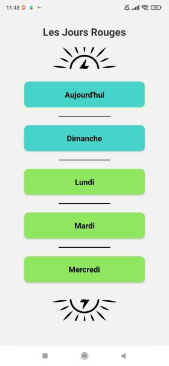

# PredicTempo

 

[EDF](https://www.edf.fr/)’s (French electricity provider) "[Tempo](https://particulier.edf.fr/fr/accueil/gestion-contrat/options/tempo/details.html)" contract offers variable electricity pricing based on the day’s color: 300 blue (cheap), 43 white (moderate), and 22 red (expensive) days per year, with red days occurring only during winter. While this helped reduce my electricity bill, EDF only reveals the next day’s color at 11 a.m., making it difficult to plan energy-intensive tasks (cooking, laundry, etc.) in advance.

PredicTempo predicts red days up to 5 days ahead using weather forecasts. I collected historical weather data from Météo‑France (2016–2024) and Tempo history from EDF, engineered features that capture conditions linked to red days, and trained a machine learning model for binary classification. The model was exported to ONNX and embedded in a React Native Android app so I can check predictions on my phone.

This project covers end-to-end machine learning: data collection, feature engineering, modeling, and mobile deployment: a practical tool to help schedule energy use and save on electricity bills.